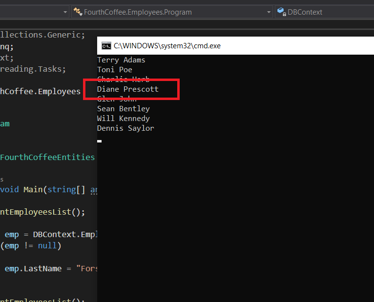
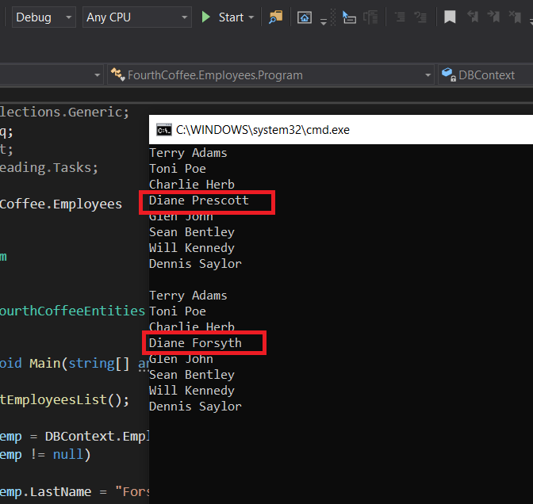

1. **Nombres y apellidos:** Carola Casais Recondo
2. **Fecha:** Domingo 18 de octubre de 2020
3. **Resumen del Ejercicio:** El onjetivo del ejercicio es modificar data en un EDM.
4. **Dificultad o problemas presentados y como se resolvieron:** No hubo dificultades en este ejercicio.

